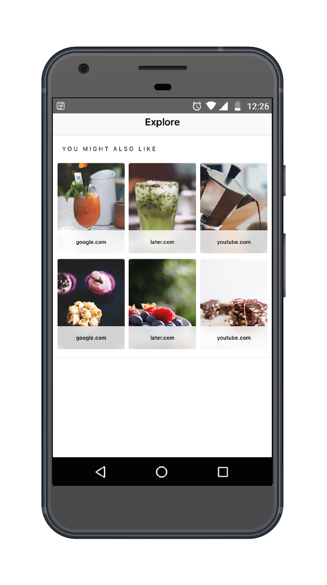
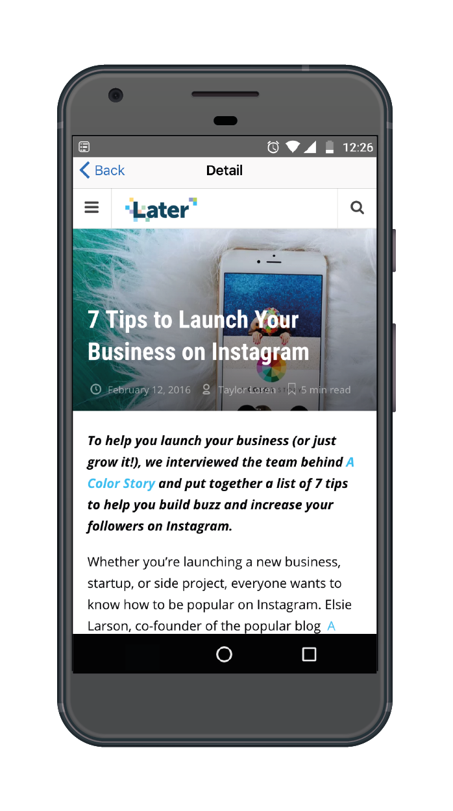

# linkinbio
Linkin.bio is a landing page that resembles your Instagram feed and displays your posts as clickable images. This makes it easy to build a clickable, shoppable feed that links your audience straight to your content.
For more, visit https://later.com/linkinbio

The **Later.com** API supplies the data, and it is rendered at <http://linkin.bio/{username}>. For and example of what this looks like in the browser, visit: <http://linkin.bio/latermedia>

As an exercise for Android, we would like you to develop an Android app that fetches these links and associated images from our server, and to display them on the screen.

We have given you a basic project outline to start with. The URL that you will need to retrieve the data from is: <https://api-prod.linkin.bio/api/pub/linkinbio_posts?instagram_profile_id=32192>

The goal of this exercise is to make the app resemble the following examples, using standard Material Design and Android UI conventions:

To complete the task, implementing the following:

1. For each post in the API response, display the `image_url ` in a `Grid` (`RecyclerView` is recommended).
2. Underneath the thumbnail, have a `TextView` showing *only the domain* for the `link_url`.
3. When a user clicks on the `RecyclerView` item, open the `link_url` of the corresponding post, without leaving the app; for example within a `WebView`, or using `Chrome Custom Tabs`.
4. Write a simple unit test that validates *some* part of your work.

## Assessment Criteria

Your submission will be assessed based on whether the above criteria have been met completely, on overall code quality and completeness.

It is not intended for this project to take up much of your time, but neither will you be penalised for going beyond what is specified above (provided that it works as intended!).

*Note:* A little Java is fine, but bear in mind that we are a Kotlin-first team so please keep it Kotlin-heavy.

### Bonus Points for..

* **Indicating Which Items Have Been Viewed 🧐** Once the website from the `link_url` is fully loaded in the browser view of your choice, visually indicate which items within the grid have already been visited by the user; this does not need to persist through an app restart, but you will not be penalised if it does.